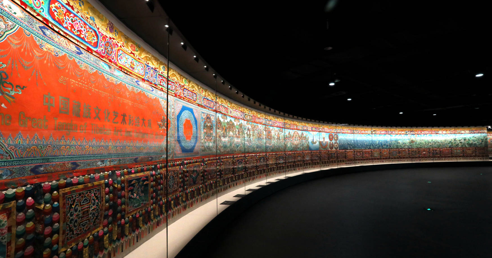
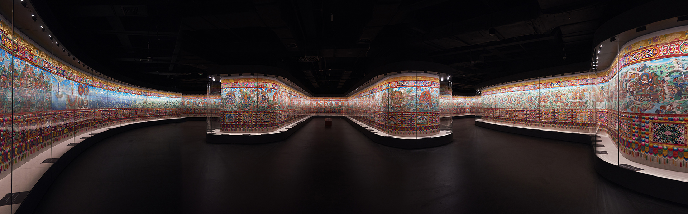
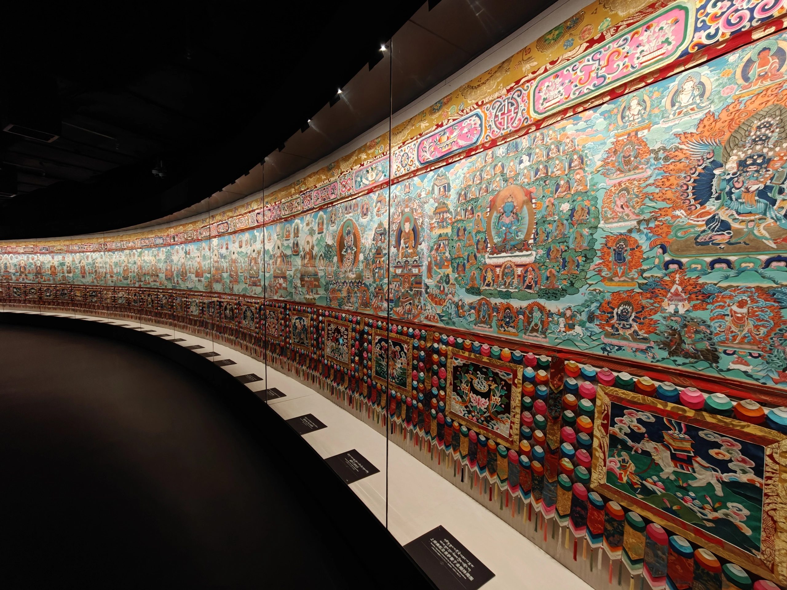
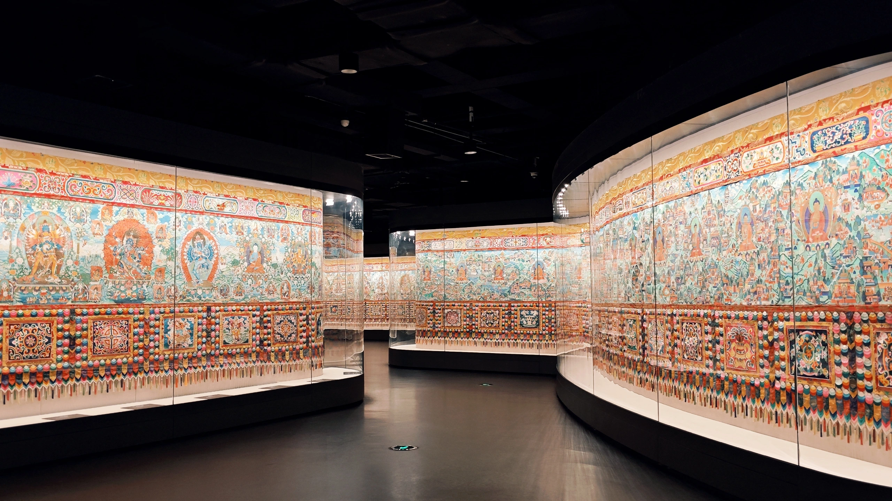
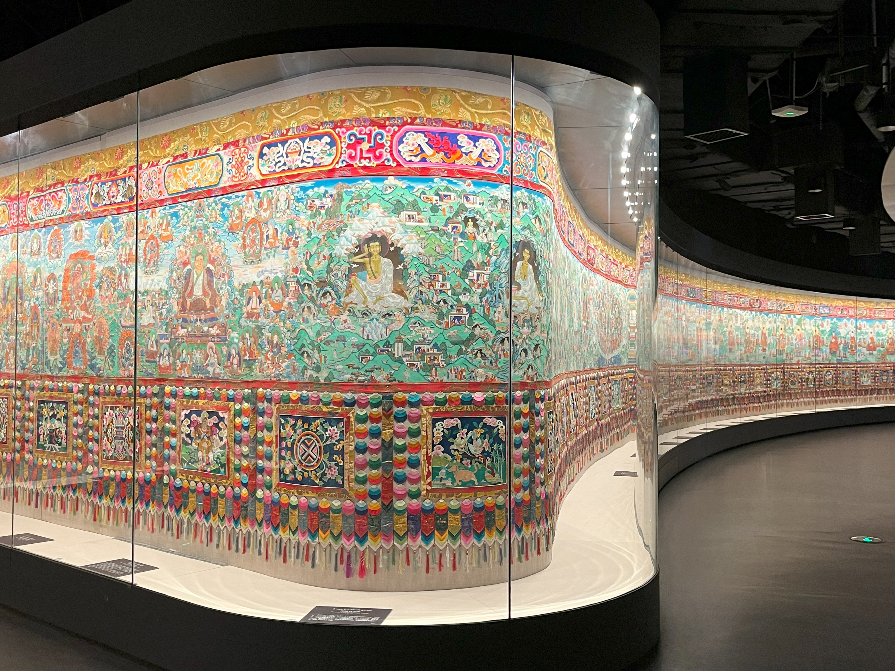

 

---

# 七、附录：中国藏族文化艺术彩绘大观（618米）

 巨幅卷轴画，由宗者拉杰先生策划、设计和主持完成，150多位优秀藏族和土族民间画家共同参与，长达618米。全卷共绘有18万3千个人物形象和大量的自然元素，由710幅组画构成，形象地呈现了藏族的宇宙观和宗教观。

| 青海藏文化博物院                                                                                                                                                 | 青海藏文化博物院                                                                                                                                                 | 青海藏文化博物院                                                                                                                                                |
| ---------------------------------------------------------------------------------------------------------------------------------------------------------------- | ---------------------------------------------------------------------------------------------------------------------------------------------------------------- | --------------------------------------------------------------------------------------------------------------------------------------------------------------- |
|  |  |  |

