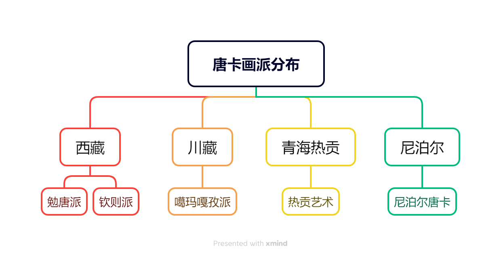
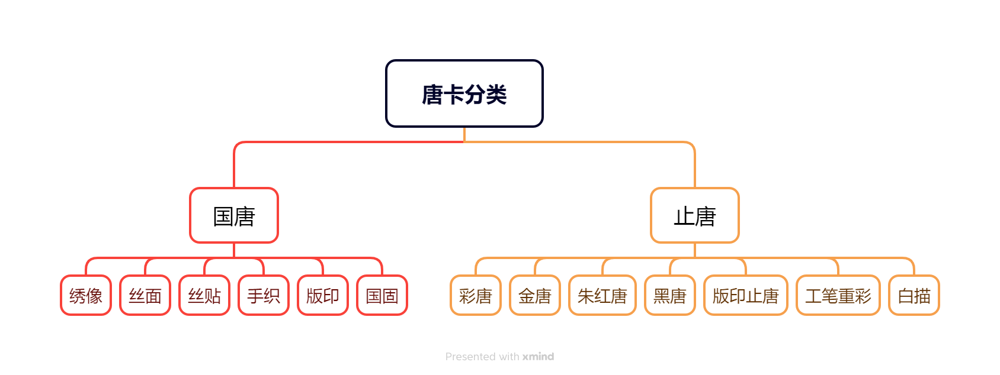
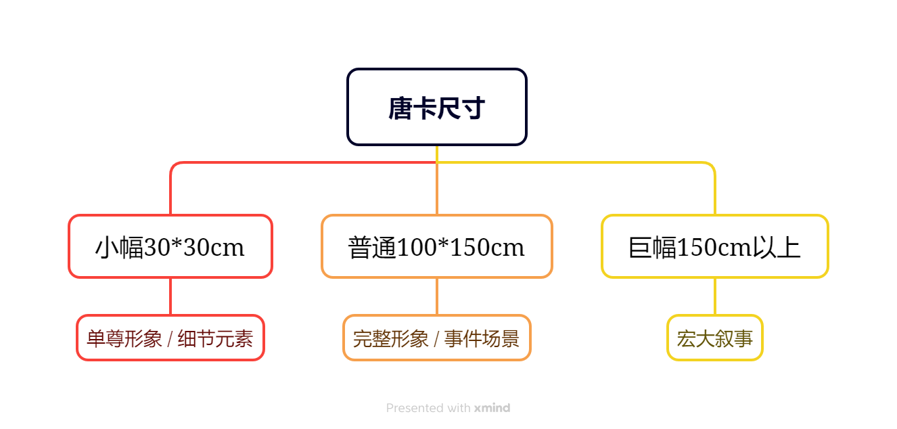

 

# 五、总结及展望

## 思维导图总结

### 1. 唐卡画派分布总结

### 2. 唐卡分类总结

---

### 3. 唐卡尺寸总结

## 总结

唐卡艺术作为藏文化的瑰宝，展现了深厚的文化底蕴、精湛的艺术技艺和独特的宗教精神。在漫长的历史传承中，唐卡吸收了印度、尼泊尔及汉地艺术的精华，发展出勉唐画派、钦孜画派、噶玛嘎孜画派及热贡画派等丰富的流派，并在宗教、艺术和社会功能上取得了多重突破。无论是作为宗教供奉的法器，还是承载历史与文化的载体，唐卡都具有不可替代的地位。然而，随着市场化与现代化进程的加速，唐卡艺术在传承过程中面临着诸多挑战，如技艺流失、商业化冲击及材料稀缺等问题。这些因素迫使唐卡艺术在创新与坚守传统之间寻求平衡。

当前，唐卡在全球化背景下逐渐成为文化交流的重要载体，其现代价值不断被挖掘。在技术手段的支持下，数字化保护与国际传播正在为唐卡注入新的生命力。同时，以热贡唐卡为代表的产业化模式也为地方经济发展提供了文化与经济融合的范例。唐卡艺术的传承与创新，不仅关乎藏族文化的延续，更为中国非物质文化遗产的保护与发展提供了重要启示。

## 展望

未来，唐卡艺术的可持续发展需要更加完善的政策支持和传承机制。例如，通过设立专项基金，提高画师待遇，以吸引更多年轻人加入；在高校及艺术教育中融入唐卡课程，加强对其技艺的系统化培养。此外，借助数字化技术，可以实现经典唐卡的高精度记录和虚拟展示，从而扩展唐卡的保护方式与传播范围。国际文化交流与跨界合作也将为唐卡艺术带来更广阔的视野和发展空间。

在创新方面，唐卡艺术可以进一步拓展题材领域，尝试与现代设计、影视制作等领域融合，丰富其表现形式和应用场景。同时，在全球化与多元文化的语境下，保持唐卡宗教性与艺术性的核心精神至关重要。唐卡艺术应继续以其深厚的文化内涵和强大的艺术张力，成为连接传统与现代、地方与国际的重要文化纽带，为中国乃至世界文化艺术的繁荣贡献力量。

